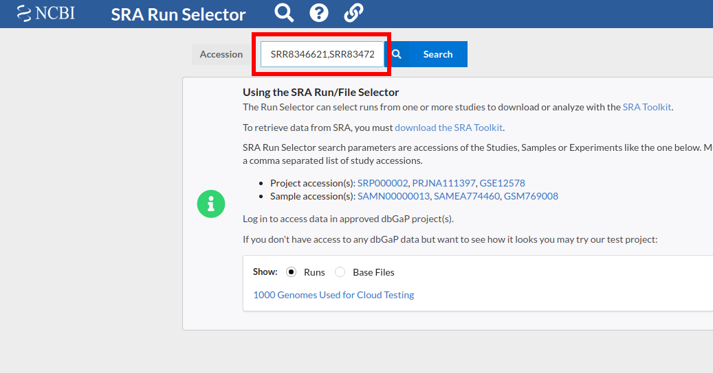
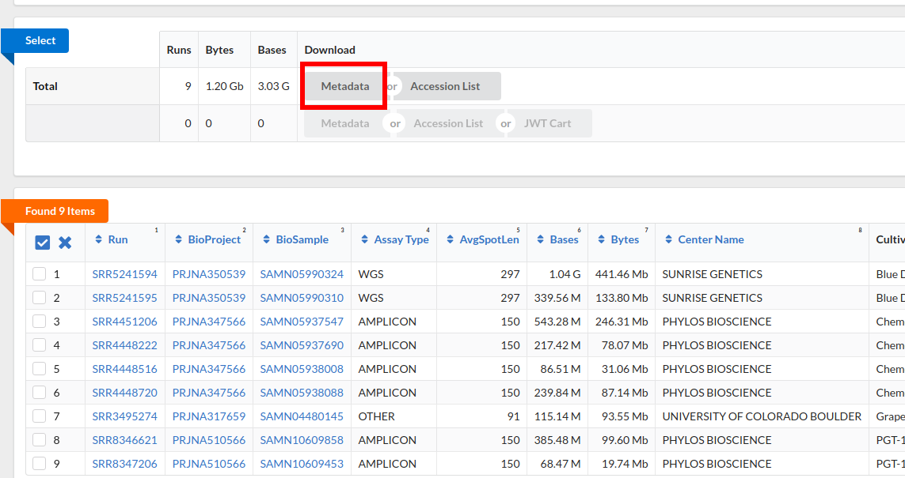

## Building genomic sequences dataset based on cannabis samples

This document aims to describe a process of building a genomic sequences dataset and running it's processing.

In this case, we will use **cannabis** samples. 

Why cannabis? Because  it is an important source of fibers and nutritional 
and medicinal compounds (used to treat: pain, nausea, anxiety, and inflammation 
as the cannabinoid compounds mimic compounds our bodies naturally produce, called endocannabinoids, 
and grows quickly in a range of environments. 

### Samples

We will work with 3 cannabis strains: AK-47, Blue Dream, and Chemdawg.
 Genomic data for the first two strains we will take from the [NCBI SRA archive](https://www.ncbi.nlm.nih.gov/sra) 
 and for the third - from the [Kannapedia](http://www.kannapedia.net).

Here is a list of source runs:

| Run ID     | Strain     | Source           | Link                                                      |
|------------|------------|------------------|-----------------------------------------------------------|
| SRR8346621 | AK-47      | NCBI SRA Archive | https://trace.ncbi.nlm.nih.gov/Traces/sra/?run=SRR8346621 |
| SRR8347206 | AK-47      | NCBI SRA Archive | https://trace.ncbi.nlm.nih.gov/Traces/sra/?run=SRR8347206 |
| SRR3495274 | AK-47      | NCBI SRA Archive | https://trace.ncbi.nlm.nih.gov/Traces/sra/?run=SRR3495274 |
| SRR5241594 | Blue Dream | NCBI SRA Archive | https://trace.ncbi.nlm.nih.gov/Traces/sra/?run=SRR5241594 |
| SRR5241595 | Blue Dream | NCBI SRA Archive | https://trace.ncbi.nlm.nih.gov/Traces/sra/?run=SRR5241595 |
| RSP10005   | Blue Dream | Kannapedia       | http://www.kannapedia.net/strains/rsp10005/               |
| RSP11342   | Blue Dream | Kannapedia       | http://www.kannapedia.net/strains/rsp11342/               |
| RSP11227   | Blue Dream | Kannapedia       | http://www.kannapedia.net/strains/rsp11227/               |
| RSP11033   | Blue Dream | Kannapedia       | http://www.kannapedia.net/strains/rsp11033/               |
| RSP11017   | Blue Dream | Kannapedia       | http://www.kannapedia.net/strains/rsp11017/               |
| SRR4448222 | Chemdawg   | NCBI SRA Archive | https://trace.ncbi.nlm.nih.gov/Traces/sra/?run=SRR4448222 |
| SRR4448516 | Chemdawg   | NCBI SRA Archive | https://trace.ncbi.nlm.nih.gov/Traces/sra/?run=SRR4448516 |
| SRR4448720 | Chemdawg   | NCBI SRA Archive | https://trace.ncbi.nlm.nih.gov/Traces/sra/?run=SRR4448720 |
| SRR4451206 | Chemdawg   | NCBI SRA Archive | https://trace.ncbi.nlm.nih.gov/Traces/sra/?run=SRR4451206 |

### Building metadata CSV

The current repository uses the [Dataflow Genomics Core Components](https://github.com/allenday/dataflow-genomics) library for processing genetics population genomics data.
As an input source, it uses a metadata CSV ([example](https://github.com/allenday/dataflow-genomics/blob/master/docs/sra_reads_annotations_example.csv)). These CSV files are parsed with [ParseSourceCsvTransform](https://github.com/allenday/dataflow-genomics/blob/master/genomics-dataflow-core/src/main/java/com/google/allenday/genomics/core/csv/ParseSourceCsvTransform.java) and transformed into run objects.

That's why before starting of data processing we should build such metadata CSV.

#### From SRA Run Table

The 9 of 14 runs of our dataset are stored in [NCBI SRA archive](https://www.ncbi.nlm.nih.gov/sra). 
We could use [SRA Run Selector](https://www.ncbi.nlm.nih.gov/Traces/study/) to generate the SRA Run Table that could be used as a source file to create metadata CSV.
Here is a list of steps for generation of SRA Run Table:

1. Concatenate source Run ID's into a comma-separated string:
    ```
    SRR8346621,SRR8347206,SRR3495274,SRR5241594,SRR5241595,SRR4448222,SRR4448516,SRR4448720,SRR4451206
    ```
2. Go to the [SRA Run Selector](https://www.ncbi.nlm.nih.gov/Traces/study/) page.
3. Paste Run ID's concatenated string into Accession field and press "Search":


4. You will see a list of runs that meet the Run ID's request from step 3. Press "Metadata" to download SRA Run Table of the found runs.

Save downloaded file's path into the variable:
    ```
    SRA_RUN_TABLE=(local_path_of_downloaded_sra_run_table)
    ```
To generate the metadata CSV from the SRA Run Table you could use the [`metadata_generator`](https://github.com/allenday/dataflow-genomics/blob/master/utilities/metadata_generator/metadata_generator.py) Python script from the [Dataflow Genomics Core Components](https://github.com/allenday/dataflow-genomics) utilities.
Firstly, choose a file name for the metadata CSV:
```
METADATA_CSV=(metadata_csv_name_to_create
```
Then you can run the `metadata_generator` script with following command: 
```
python metadata_generator.py $METADATA_CSV --sra_run_table_file $SRA_RUN_TABLE
```

#### Manually with provided metadata
The other 5 runs that we still haven't processed are stored at the [Kannapedia](http://www.kannapedia.net) platform. 
In this case, we cannot generate an SRA Run Table. That's why we will add metadata info manually.

There are 5 required fields for metadata CSV:
- _runId_
- _sampleId_
- _studyId_
- _paired or single read_
- _platform_ (name of a sequencing instrument that will be used for identifying a sequence alignment strategy)

In our case, we will use a Kannapedia Run ID for all ID's (_studyId_, _runId_,  _sampleId_). 
If we inspect one of the runs, we will see that they are _paired_ and have approx. 150 bases sequence length. 
That's why we will set _platform_ as ILLUMINA (because Illumina sequencers have the same result characteristics)  

Let's append manual metadata to the already existed `METADATA_CSV` using [`metadata_generator`](https://github.com/allenday/dataflow-genomics/blob/master/utilities/metadata_generator/metadata_generator.py):

```bash
IDS=(RSP10005 RSP11342 RSP11227 RSP11033 RSP11017)
PLATFORM=ILLUMINA

for ID in "${IDS[@]}"
do
    python metadata_generator.py $METADATA_CSV \
        --manually \
        --run_id $ID \
        --sample_id $ID \
        --study_id $ID \
        --platform $PLATFORM \
        --paired
done
```
As a result, `wc -l $METADATA_CSV` should return **20** lines (19 runs metadata's + 1 header line).

## Data placement and pipeline running

Preparing sequence data (FASTQ files) and reference data, settings of pipeline's parameters and running Dataflow job 
are described in details in the [GIAB example readme](https://github.com/allenday/dataflow-genomics/tree/master/giab-example/README.md) of the [Dataflow Genomics Core Components](https://github.com/allenday/dataflow-genomics)